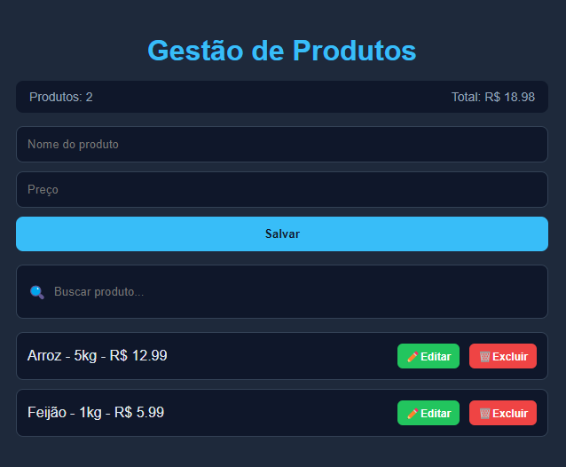

# 📦 CRUD de Produtos - JavaScript Puro

Sistema de cadastro de produtos desenvolvido com HTML, CSS e JavaScript puro, com foco em lógica de programação, manipulação do DOM e armazenamento local (LocalStorage).

---

## 🚀 Demonstração

---

## ✨ Funcionalidades

- Adicionar produtos  
- Editar produtos  
- Remover produtos  
- Buscar produtos em tempo real  
- Salvamento automático com LocalStorage  
- Dashboard com total de produtos e valor total  

---

## 🧠 Tecnologias utilizadas

- HTML5  
- CSS3  
- JavaScript
- LocalStorage API  

---

## 📁 Estrutura do projeto

/
- index.html  
- style.css  
- script.js  

---

## ⚙️ Como executar o projeto

1. Clone o repositório:

git clone https://github.com/SEU-USUARIO/SEU-REPOSITORIO.git

2. Abra o arquivo index.html no navegador

---

## 📚 Aprendizados

- Manipulação do DOM  
- Eventos em JavaScript  
- CRUD completo  
- Organização de código  
- Uso do LocalStorage  
- Lógica de programação aplicada  

---

## 📌 Status do projeto

Finalizado (versão base)  
Em melhorias futuras  

---

## 👨‍💻 Autor

Luiz Alberto  
GitHub: https://github.com/LuizAlbertoDev  
LinkedIn: https://linkedin.com/in/luizalbertodev  

---

## ⭐ Se curtiu o projeto

Deixe uma estrela no repositório 🚀